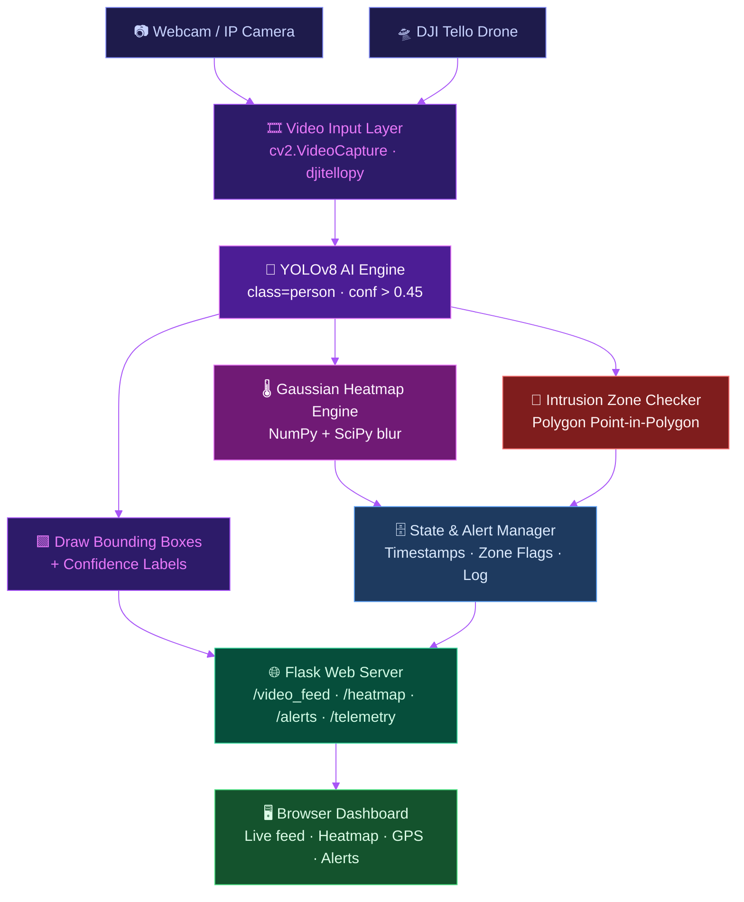
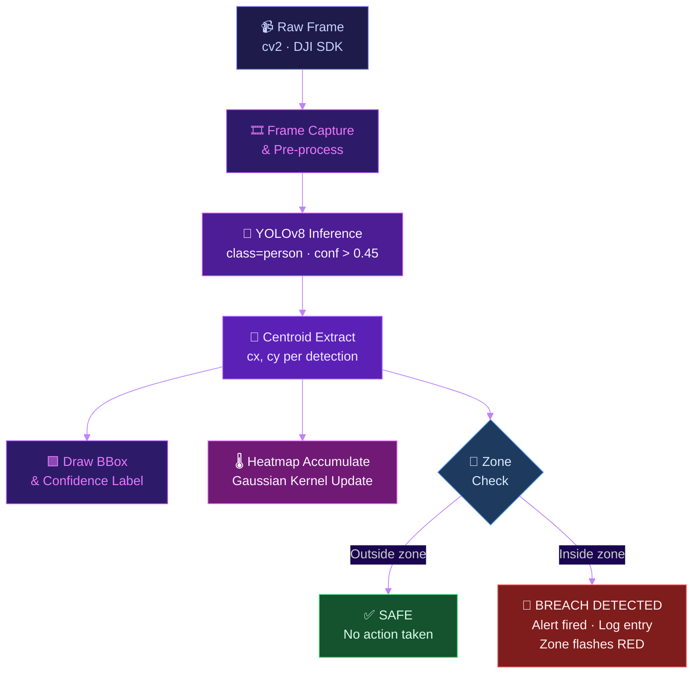
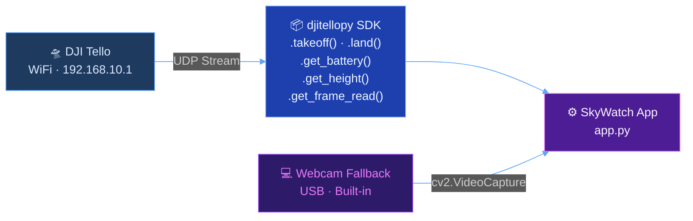
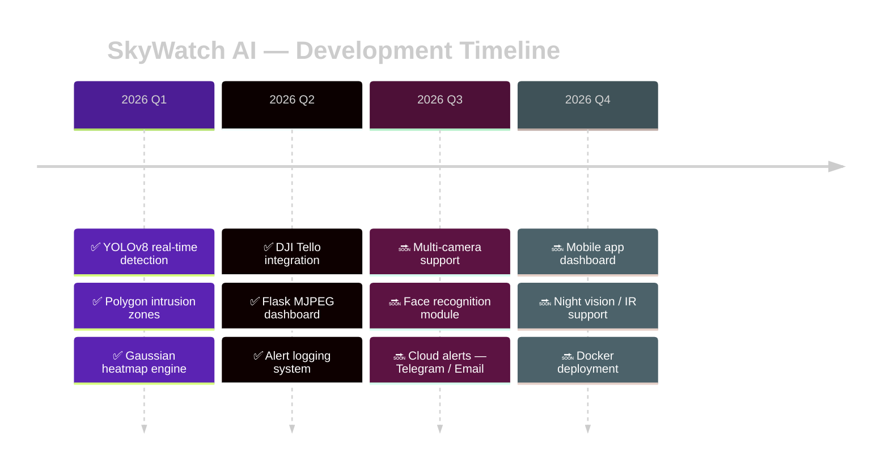

<div align="center">


<br/>

<a href="https://git.io/typing-svg">
  
</a>

<br/><br/>


<br/>


<br/><br/>


</div>

---

## 📸 Live Dashboard

<div align="center">


*Live dashboard — detection feed · heatmap overlay · GPS telemetry · alert log*

</div>

---

## 🌐 Introduction

<div align="center">


</div>

<br/>

> *"The sky has eyes — and they're powered by AI."*

**SkyWatch AI** is a next-generation, open-source **aerial surveillance platform** engineered by **Luthando Candlovu** in **2026**. It seamlessly merges cutting-edge **drone hardware**, state-of-the-art **computer vision**, and **real-time web analytics** into a single, production-ready system.

At its core, SkyWatch AI harnesses the raw detection power of **YOLOv8** — the world's leading real-time object detection model — to spot humans in milliseconds, track their movement, and instantly flag any breach of a restricted zone. Every detection feeds into a **live Gaussian heatmap** that builds a visual history of movement patterns over time, giving security operators intelligence that goes far beyond a simple camera feed.

The system connects natively to **DJI Tello drones** over WiFi, enabling true aerial coverage with live telemetry (battery, altitude, speed) streamed directly to the dashboard. Whether you're securing a perimeter, monitoring crowd flow, or conducting reconnaissance — SkyWatch AI delivers **military-grade situational awareness in a developer-friendly package**.

<div align="center">

| 🎯 What it detects | 🔴 How it alerts | 🌡️ How it maps | 🛸 How it flies |
|:---|:---|:---|:---|
| Humans in real time with bounding boxes | Fires an instant alert when a centroid enters a polygon zone | Builds a Gaussian heatmap frame by frame | Pairs with DJI Tello via WiFi UDP |
| Confidence score above every detection | Logs every breach with a full timestamp | Overlays heat data semi-transparently on the live feed | Falls back to webcam if no drone found |
| Tracks multiple people simultaneously | Zone border flashes red on breach | Reveals where people spend the most time | Streams GPS telemetry to the dashboard |

</div>

---

## 🎬 Live Demo

<div align="center">

<video src="https://github.com/user-attachments/assets/34591ef6-707a-4cf4-badc-281e15faa82a" controls width="92%"></video>

*Real-time human detection · intrusion zone triggering · heatmap building live*

</div>

---

## ✨ Features

<div align="center">

```
╔══════════════════════════════════════════════════════════════════════════╗
║   ◈  SKYWATCH AI — PERFORMANCE OVERVIEW                                 ║
╠══════════════════════════════════════════════════════════════════════════╣
║   🎯  DETECTION ACCURACY   ████████████████████████████░░   94 %       ║
║   ⚡  STREAM SPEED         ████████████████████░░░░░░░░░░   30 FPS    ║
║   📡  RESOLUTION COVER     ████████████████████████░░░░░░   Full HD   ║
║   🔋  CPU / GPU EFF.       ███████████████████████████░░░   Adaptive  ║
║   🌡️  HEATMAP DETAIL       ██████████████████████████░░░░   Gaussian  ║
║   🚨  ALERT LATENCY        ████████████████████████████░░   < 50 ms   ║
╚══════════════════════════════════════════════════════════════════════════╝
```

</div>

---

## 🏗️ System Architecture

<div align="center">


</div>

<br/>



---

## 🔄 Detection Pipeline

<div align="center">


</div>

<br/>



---

## 🛸 Drone Support

<div align="center">


</div>

<br/>



<br/>

<div align="center">

| Mode | Video Source | GPS Data |
|:---|:---|:---|
| 🛸 **Drone Mode** | DJI Tello UDP stream | Real flight telemetry |
| 💻 **Webcam Mode** | USB / built-in camera | Simulated circular path |

</div>

---

## 🚀 Quick Start

```bash
# 1 — Clone
git clone https://github.com/yourusername/skywatch-ai.git
cd skywatch-ai

# 2 — Create virtual environment
python -m venv venv
source venv/bin/activate        # Linux / macOS
venv\Scripts\activate           # Windows

# 3 — Install dependencies
pip install -r requirements.txt

# 4 — Launch
python app.py
```

```
🌐  Open http://localhost:5000 in your browser
```

> Stand in front of your camera — detection starts immediately. No config needed.

---

## 🎮 Usage Guide

<details>
<summary><b>🧍 Human Detection</b></summary>
<br/>

- A **green bounding box** wraps each detected person in real time
- Confidence score shown above each box
- Multiple people tracked simultaneously — no limit

</details>

<details>
<summary><b>🔴 Intrusion Zone Alerts</b></summary>
<br/>

- A **blue polygon** marks the restricted area on the frame
- When any centroid crosses inside → **RED alert fires instantly**
- Alert logged with full timestamp in the dashboard sidebar
- Zone border flashes red to confirm the breach visually

</details>

<details>
<summary><b>🌡️ Live Heatmap</b></summary>
<br/>

- Builds automatically as people move through the frame
- **Red / yellow** = high-frequency movement areas
- **Blue / cool** = rare or no movement
- Semi-transparently overlaid on the live feed

</details>

<details>
<summary><b>🛸 Drone Mode (DJI Tello)</b></summary>
<br/>

- Connect your machine to **Tello's WiFi** before launching
- App auto-detects the drone via UDP on startup
- Live telemetry: battery %, height, speed
- GPS panel traces real flight path on the dashboard
- Falls back gracefully to webcam if no drone is found

</details>

---

## 📦 Requirements

```txt
ultralytics>=8.0.0       # YOLOv8 detection engine
flask>=2.3.0             # Web server & MJPEG streaming
opencv-python>=4.8.0     # Frame capture, drawing, encoding
numpy>=1.24.0            # Array math & heatmap accumulator
scipy>=1.11.0            # Gaussian blur for smooth heatmap
djitellopy>=2.4.0        # DJI Tello drone SDK (optional)
Pillow>=10.0.0           # Image handling
```

---

## 📁 Project Structure

```
skywatch-ai/
│
├── 📄 app.py                   ← Flask app + routes
├── 📄 detector.py              ← YOLOv8 detection logic
├── 📄 heatmap.py               ← Gaussian heatmap engine
├── 📄 zone_manager.py          ← Intrusion polygon logic
├── 📄 drone_controller.py      ← DJI Tello / webcam handler
├── 📄 gps_simulator.py         ← Flight path simulator
├── 📄 requirements.txt
│
├── 📁 templates/
│   └── 📄 index.html           ← Web dashboard UI
│
├── 📁 static/
│   ├── 📁 css/                 ← Dashboard styles
│   └── 📁 js/                  ← Live update scripts
│
├── 📁 models/
│   └── 📄 yolov8n.pt           ← YOLOv8 nano weights
│
└── 📄 README.md
```

---

## 🧠 Tech Stack

<div align="center">


<br/><br/>

| Layer | Technology | Purpose |
|:---:|:---|:---|
| 🧠 AI | YOLOv8 · PyTorch | Human detection & bounding boxes |
| 🎥 Vision | OpenCV | Frame capture, drawing, MJPEG encode |
| 🌡️ Analytics | NumPy + SciPy | Heatmap accumulation & Gaussian blur |
| 🌐 Server | Flask | Live streaming + REST alert API |
| 🖥️ Frontend | HTML · CSS · JS | Dashboard + real-time updates |
| 🛸 Hardware | djitellopy | DJI Tello control & telemetry |

</div>

---

## 🗺️ Roadmap



---

## 🤝 Contributing

```bash
# 1. Fork the repo
# 2. Create your feature branch
git checkout -b feature/your-feature

# 3. Commit your changes
git commit -m "feat: add your feature"

# 4. Push
git push origin feature/your-feature

# 5. Open a Pull Request 🚀
```

---

## 📄 License

```
MIT License — free to use, modify, and distribute.
See LICENSE for full details.
```

---

<div align="center">


<br/>


</div>
